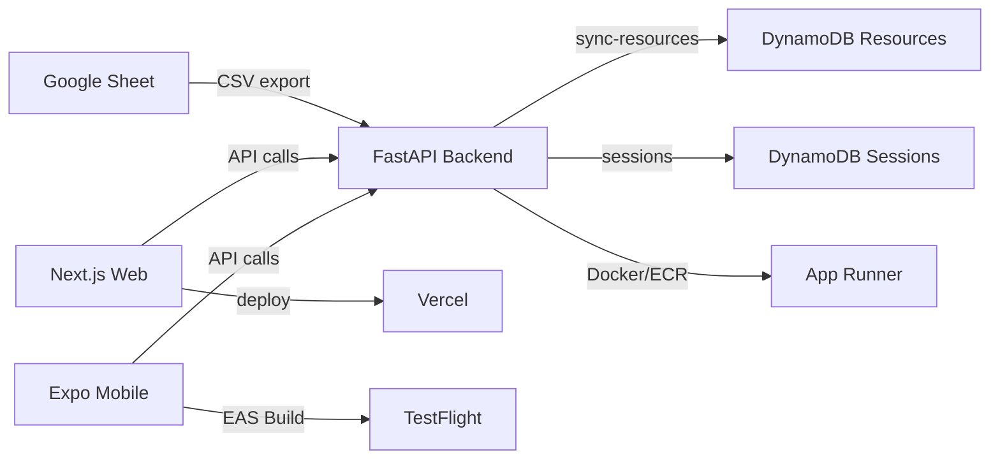

# Architecture

## Repository Structure

```
frontend/          React Native Expo app (iOS/Android)
web/               Next.js web app (mirrors frontend)
backend/           FastAPI Python backend on AWS App Runner
infra/             AWS CDK (DynamoDB, ECR, App Runner)
docs/              This documentation (Obsidian vault)
```

## Infrastructure



## Key Services

| Service | URL / ARN |
|---------|-----------|
| Backend API | `https://iutm2kyhqq.us-east-1.awsapprunner.com` |
| Web App | Deployed on Vercel (see [[Deployment]]) |
| ECR Repo | `050451400186.dkr.ecr.us-east-1.amazonaws.com/cancer-app-backend` |
| Google Sheet | ID: `1sEAYOOJfmmAU92wEQuUkezpiWJMo_grJb3W-1vJopoM` |
| App Runner ARN | `arn:aws:apprunner:us-east-1:050451400186:service/cancer-app-backend/185367acf06345f1b9fd2d6a3501c90b` |

## DynamoDB Tables

### Sessions
- **Partition Key**: `sessionId` (String)
- **Sort Key**: `createdAt` (String)
- **TTL**: `expiresAt` (30 days)
- Stores: user answers, match logs with full reasoning

### Resources
- **Partition Key**: `resourceId` (String)
- Stores: synced sheet data + manually added resources
- Fields: `name`, `helpTypes`, `cancerTypes`, `cities`, `countries`, `entireCountry`, `minAge`, `maxAge`, `patientCarer`, `treatmentStage`, `websiteUrl`, `contact`

## Key Files

| File | Purpose |
|------|---------|
| `frontend/utils/match.ts` | Matching logic with full audit trail |
| `frontend/services/api.ts` | API client + sheet data mapping |
| `frontend/data/resources.ts` | Resource interface, HELP_TYPES, constants |
| `backend/main.py` | All API endpoints |
| `infra/cancer_app_stack.py` | AWS CDK infrastructure |
| `web/src/app/admin/page.tsx` | Sheet <-> DynamoDB sync dashboard |
