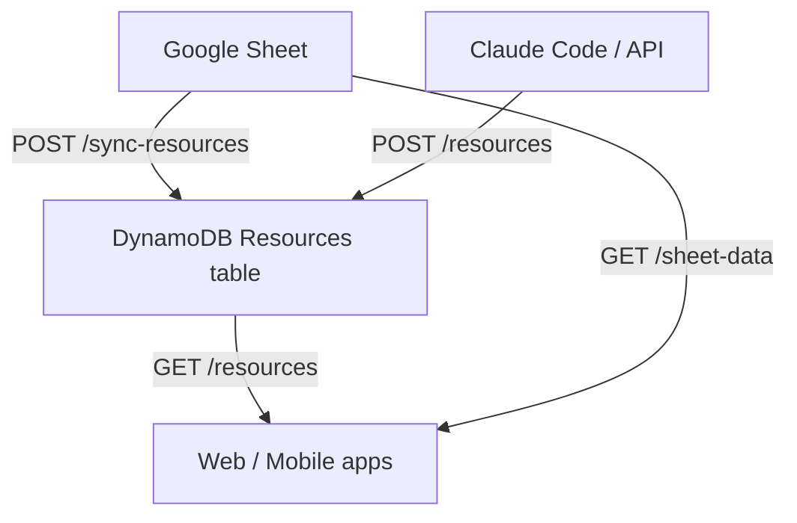
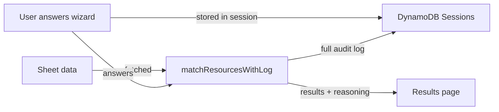

# Data Flow

## How Resources Get Into the System

### Source 1: Google Sheet (primary)
1. Resources are maintained in a Google Sheet
2. `POST /sync-resources` pulls all rows and upserts into DynamoDB
3. The `/admin` page shows live diff between sheet and DB
4. "Sync Now" button triggers a full sync

### Source 2: Direct API (manual additions)
1. `POST /resources` adds a resource directly to DynamoDB
2. These show as "inDbOnly" on the admin sync page
3. Used by the [[Adding Resources|human-in-the-loop cycle]]

## How Matching Works

1. User goes through the 6-step [[Wizard Flow]]
2. Answers stored in session via `PUT /sessions/{id}`
3. On results page, app fetches resources from `/sheet-data`
4. `matchResourcesWithLog()` runs the [[Matching Logic]] filters
5. Results shown to user, full match log saved to DynamoDB via `POST /sessions/{id}/match-log`

## City Autocomplete

The location typeahead merges cities from **both** sources:
- Google Sheet `Cities Available` column
- DynamoDB Resources `cities` field

This ensures manually-added resources with new cities (e.g., Manchester, Glasgow) appear in autocomplete even if the sheet doesn't have them.
